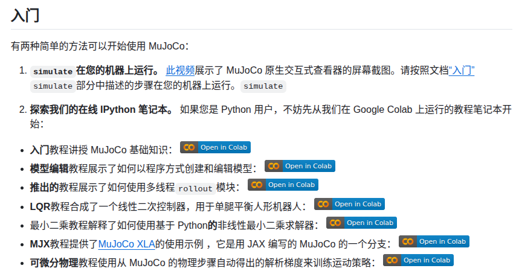

# MuJoCo Playground

## Conda 使用
```bash
# windows 上在 conda activate 前先运行以下代码
source ~/miniconda3/etc/profile.d/conda.sh
```

## 官方网站

总网站
https://mujoco.org/

GitHub 网站
https://github.com/google-deepmind/mujoco

函数介绍网站
https://mujoco.readthedocs.io/en/stable/overview.html  

MuJoCo 支持 C++ 和 Python



## 使用指南
```bash
# 安装相关依赖
./install/install.sh

# 进入 examples 查看 example 1-3 案例
```

## MuJoCo 可视化
```bash
python3 view_go2.py

# 双击选中零件
# ctrl + 左键 添加力矩
# ctrl + 右键 添加力
```

## 什么是 MuJoCo Playground?


## 更新日志
- 2025.9.21 周日
  - 在 windows 上测试可以使用 view_go2.py 使用 MuJoCo GUI
  - 在 windows 上测试可以 Project 1 可以使用 hydra 